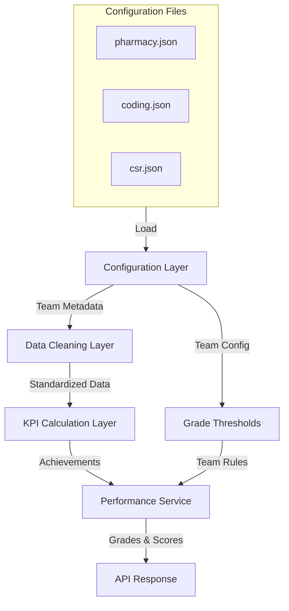

# Design Document: Three Teams KPI Implementation

## Overview

This design adds support for three new teams (Pharmacy, Coding, CSR) to the PMS Dashboard with distinct KPI configurations, calculation logic, and capping rules. Each team has its own set of KPIs with specific weights, directions (inverse/direct), and performance calculation approaches. Pharmacy achievements can exceed 100% (uncapped), while Coding and CSR achievements are capped at 100% maximum. This implementation extends the existing KPI calculation architecture to handle multiple team configurations consistently.

## Architecture



## Components and Interfaces

### 1. Configuration Layer

#### Team Configuration Files Structure

Each team has a JSON configuration file in `Backend/config/teams/`:

```python
# pharmacy.json structure
interface TeamConfig {
  team: string                  # Team name ("Pharmacy", "Coding", "CSR")
  db_name: string              # Database reference
  region: string               # Region (e.g., "UAE", "EGY")
  employee_id_col: string      # Column name for employee ID
  employee_name_col: string    # Column name for employee name
  grade_thresholds: {
    A: number                  # Grade A threshold
    B: number                  # Grade B threshold
    C: number                  # Grade C threshold
    D: number                  # Grade D threshold
  }
  kpis: KPIDefinition[]        # Array of KPI definitions
}

interface KPIDefinition {
  key: string                  # Unique KPI identifier
  label: string                # Display label
  weight: number               # Weight as decimal (0.0 - 1.0)
  direction: string            # "higher_better" | "lower_better"
  unit: string                 # Unit of measurement ("%", "min", etc)
  color: string                # Hex color code
  actual_col: string           # Excel column name for actual values
  target_col: string           # Excel column name for target values
  achievement_col: string      # Optional: pre-calculated achievement column
  capping: string              # "uncapped" | "capped_at_100"
}
```

**Team Configurations:**

- **Pharmacy**: 5 KPIs, uncapped achievements
  - WaitingTime (inverse, 20%)
  - Leakage (inverse, 20%)
  - TenderCompliance (direct, 20%)
  - ATV (direct, 20%)
  - Prescription (direct, 20%)
  - Thresholds: A(95), B(85), C(75), D(65)

- **Coding**: 3 KPIs, capped at 100%
  - QualityErrors (inverse, 20%)
  - Rejection (inverse, 50%)
  - TAT (inverse, 30%)
  - Thresholds: A(95), B(85), C(75), D(65)

- **CSR**: 3 KPIs, capped at 100%
  - Rejection (inverse, 40%)
  - Queries (direct, 30%)
  - AttendedCR (direct, 30%)
  - Thresholds: A(95), B(85), C(75), D(65)

### 2. Data Cleaning Layer

#### Data Cleaner Pattern

```python
# Base pattern used by all team cleaners
class TeamCleaner:
  """Base class for standardizing team-specific data"""
  
  def process(file_path: str, sheet_name: str) -> DataFrame
  def standardize_columns(df: DataFrame) -> DataFrame
  def parse_percentage(value: Any, is_fraction: bool = False) -> float
  def calculate_kpi_achievement(
    actual: float, 
    target: float, 
    is_inverse: bool = False,
    cap_at_100: bool = False
  ) -> float
  def calculate_performance_score(
    achievements: Dict[str, float],
    weights: Dict[str, float]
  ) -> float
  def assign_grade(score: float, thresholds: Dict[str, int]) -> str
```

#### Specific Cleaners

**Pharmacy Cleaner** (`Backend/Data_Cleaning_Teams/pharmacy.py`):
- Inherits from base cleaner
- Handles 5 KPIs with uncapped achievements
- Special handling for WaitingTime (inverse: Target/Actual)
- Formula: Performance = (Σ achievement_i × weight_i) uncapped
- Example: 95 × 0.20 + 110 × 0.20 + 80 × 0.20 + 105 × 0.20 + 90 × 0.20 = 96% (uncapped)

**Coding Cleaner** (`Backend/Data_Cleaning_Teams/coding.py`):
- Handles 3 inverse KPIs with capping
- Formula: capped_achievement = MIN(1.0, Target/Actual)
- Then: Performance = MIN(1.0, Σ capped_achievement_i × weight_i) capped at 100%
- Example: capping prevents single KPI achievement >100% from inflating final score

**CSR Cleaner** (`Backend/Data_Cleaning_Teams/csr.py`):
- Handles mix of inverse (Rejection) and direct (Queries, AttendedCR) KPIs
- All achievements capped at 100% before weighting
- Similar capping logic to Coding team

### 3. KPI Calculation Logic

#### Achievement Calculation (Core Formula)

**For Direct KPIs (higher is better):**
```
achievement = (actual / target) × 100
```

**For Inverse KPIs (lower is better):**
```
achievement = (target / actual) × 100
```
Special case: If actual = 0, achievement = 100 (no division by zero)

**Capping Logic:**
```
if team in ["Coding", "CSR"]:
  capped_achievement = MIN(achievement, 100)
else:  # Pharmacy
  capped_achievement = achievement (no capping)
```

#### Performance Score Calculation

**For Pharmacy (Uncapped):**
```
score = Σ(capped_achievement_i × weight_i)
Result: Can exceed 100%
```

**For Coding & CSR (Capped):**
```
score = MIN(1.0, Σ(capped_achievement_i × weight_i))
Result: Maximum 100%
```

#### Grade Assignment

Universal algorithm for all teams:
```python
def assign_grade(score: float, thresholds: Dict[str, int]) -> str:
  if score >= thresholds["A"]: return "A"
  if score >= thresholds["B"]: return "B"
  if score >= thresholds["C"]: return "C"
  if score >= thresholds["D"]: return "D"
  return "E"
```

### 4. Data Models

#### Team Configuration Table

```python
class TeamKPIConfig(Base):
  """Stores team-specific KPI definitions"""
  id: UUID
  team_id: UUID (FK -> teams.id)
  kpi_key: string         # e.g., "WaitingTime"
  kpi_label: string       # e.g., "Waiting Time"
  weight: Decimal(5, 4)   # e.g., 0.2000
  direction: string       # "higher_better" | "lower_better"
  unit: string            # "%", "min", etc
  color: string           # Hex color
  actual_col: string      # Excel column
  target_col: string      # Excel column
  achievement_col: string # Optional pre-calculated
  capping: string         # "uncapped" | "capped_at_100"
  display_order: int
```

#### KPI Value Storage

```python
class KPIValue(Base):
  """Stores calculated KPI values for each performance record"""
  id: UUID
  record_id: UUID          # FK -> performance_records.id
  record_year: int         # Composite key for partitioning
  kpi_key: string          # Identifies which KPI
  actual_value: Decimal    # Parsed actual from Excel
  target_value: Decimal    # Parsed target from Excel
  achievement_ratio: Decimal(10, 4)  # Calculated 0-N (may be >1.0)
  weight_applied: Decimal  # Weight for this KPI
  contribution: Decimal    # achievement × weight
```

### 5. Service Layer

#### KPI Service Enhancements

```python
class KPIService:
  """Enhanced to support multiple team configurations"""
  
  def calculate_performance(
    self,
    team_id: str,
    row: Dict[str, Any]
  ) -> Tuple[float, str, Dict[str, float]]:
    """
    Calculate performance score, grade, and KPI contributions
    
    Args:
      team_id: Team identifier
      row: Data row from Excel
    
    Returns:
      (score, grade, kpi_contributions)
    """
    # 1. Load team config
    # 2. Parse KPI values (actual/target)
    # 3. Calculate achievements (apply direction & capping)
    # 4. Calculate weighted performance
    # 5. Assign grade
    # 6. Return results
  
  def _parse_kpi_value(
    self,
    row: Dict,
    col_name: str,
    direction: str
  ) -> float:
    """Parse and normalize KPI value from row"""
  
  def _calculate_achievement(
    self,
    actual: float,
    target: float,
    is_inverse: bool,
    cap_at_100: bool,
    zero_actual_value: float = 1.0
  ) -> float:
    """
    Calculate achievement ratio with direction and capping.
    
    Preconditions:
      - actual >= 0, target >= 0
      - if is_inverse and actual == 0: return zero_actual_value
    
    Postconditions:
      - if cap_at_100: return <= 1.0
      - if not cap_at_100: return unbounded
    """
  
  def _calculate_weighted_score(
    self,
    achievements: Dict[str, float],
    weights: Dict[str, float],
    cap_final_at_100: bool
  ) -> float:
    """Sum weighted achievements, optionally capping final result"""
```

#### Excel Processor Enhancements

```python
class ExcelProcessor:
  """Enhanced to handle multiple team configurations"""
  
  def process_team_upload(
    self,
    file_path: str,
    team_name: str,
    month: str,
    year: int
  ) -> List[PerformanceRecord]:
    """
    Process Excel file for a specific team using its configuration.
    
    Flow:
    1. Load team configuration from JSON
    2. Find sheet in Excel (team_name or config.sheet_name)
    3. Use team-specific cleaner to standardize data
    4. Parse rows using KPIService
    5. Create PerformanceRecords with KPIValues
    """
```

### 6. Configuration Loading

#### Config Loader Pattern

```python
class ConfigLoader:
  """Loads and validates team configurations from JSON"""
  
  def load_team_config(team_name: str) -> TeamConfig:
    """
    Load team configuration from Backend/config/teams/{team_name}.json
    
    Validation:
      - All required fields present
      - Weights sum to 1.0
      - Grade thresholds in descending order (A > B > C > D)
      - All referenced columns are strings
    """
  
  def validate_config(config: TeamConfig) -> Tuple[bool, List[str]]:
    """Return (is_valid, [error_messages])"""
```

### 7. Seeding Service Enhancements

```python
class SeedingService:
  """Enhanced to seed all three team configurations"""
  
  def seed_all_teams() -> None:
    """
    1. Load pharmacy.json, coding.json, csr.json
    2. For each config:
       a. Create Team record
       b. Create GradeThreshold record
       c. Create TeamKPIConfig records (one per KPI)
    3. Verify all teams can be queried
    """
```

### 8. Example Usage - Pharmacy Team

```python
# Load configuration
config = ConfigLoader.load_team_config("Pharmacy")

# Sample row from Excel
row = {
  "EmployeeID": "P001",
  "EmployeeName": "Ahmed Hassan",
  "A.TotalAvgWaitingTime": 5.2,  # Actual minutes
  "T.TotalWaitingTime": 4.0,      # Target minutes
  "A.Leakage%": 2.5,              # Actual percentage
  "T.Leakage%": 3.0,              # Target percentage
  "A.TenderItemCompliance": 94,   # Actual count/percentage
  "T.TenderItemCompliance": 100,  # Target
  "A.ATV": 150,                   # Actual average
  "T.ATV": 140,                   # Target
  "A.NoofPrescriptionsContribution": 85,
  "T.NoofPrescriptionsContribution": 90
}

# Calculate performance
kpi_service = KPIService()
score, grade, kpi_values = kpi_service.calculate_performance("Pharmacy", row)

# Results:
# WaitingTime achievement = 4.0/5.2 = 76.92% (inverse)
# Leakage achievement = 3.0/2.5 = 120% (inverse, uncapped!)
# TenderCompliance achievement = 94/100 = 94% (direct)
# ATV achievement = 150/140 = 107.14% (direct, uncapped!)
# Prescription achievement = 85/90 = 94.44% (direct)
# 
# Score = 76.92×0.20 + 120×0.20 + 94×0.20 + 107.14×0.20 + 94.44×0.20
#       = 15.38 + 24 + 18.8 + 21.43 + 18.89
#       = 98.5% (exceeds 100% possible due to uncapped achievements)
# Grade = A (≥ 95)
```

### 9. Example Usage - Coding Team

```python
# Load configuration
config = ConfigLoader.load_team_config("Coding")

# Sample row
row = {
  "EmployeeID": "C001",
  "EmployeeName": "Fatima Al-Mansouri",
  "A.QualityErrors": 5,           # Actual errors
  "T.QualityErrors": 3,           # Target errors
  "A.Rejection": 8,               # Actual rejections
  "T.Rejection": 2,               # Target rejections
  "A.TAT_Hours": 24,              # Actual turnaround
  "T.TAT_Hours": 20                # Target turnaround
}

# Calculate performance
score, grade, kpi_values = kpi_service.calculate_performance("Coding", row)

# Results:
# QualityErrors achievement = 3/5 = 60% (inverse, capped at 100%)
# Rejection achievement = 2/8 = 25% (inverse, capped at 100%)
# TAT achievement = 20/24 = 83.33% (inverse, capped at 100%)
#
# Score (before capping) = 60×0.20 + 25×0.50 + 83.33×0.30
#                        = 12 + 12.5 + 25
#                        = 49.5%
# Score (after capping) = MIN(1.0, 0.495) = 49.5% (under 100%, no change)
# Grade = C (≥ 75? No, so ≥ 65? No, so ≥ D threshold)
```

### 10. Example Usage - CSR Team

```python
# Load configuration
config = ConfigLoader.load_team_config("CSR")

# Sample row
row = {
  "EmployeeID": "CSR001",
  "EmployeeName": "Sarah Mohammed",
  "A.Rejection": 12,              # Actual rejections
  "T.Rejection": 5,               # Target rejections
  "A.Queries": 450,               # Actual queries handled
  "T.Queries": 400,               # Target queries
  "A.AttendedCR": 95,             # Actual attended calls
  "T.AttendedCR": 90               # Target attended calls
}

# Calculate performance
score, grade, kpi_values = kpi_service.calculate_performance("CSR", row)

# Results:
# Rejection achievement = 5/12 = 41.67% (inverse, capped at 100%)
# Queries achievement = 450/400 = 112.5% → capped to 100%
# AttendedCR achievement = 95/90 = 105.56% → capped to 100%
#
# Score (before capping) = 41.67×0.40 + 100×0.30 + 100×0.30
#                        = 16.67 + 30 + 30
#                        = 76.67%
# Score (after capping) = MIN(1.0, 0.7667) = 76.67% (under 100%)
# Grade = B (≥ 85? No, but ≥ 75? Yes)
```

## Correctness Properties

*A property is a characteristic or behavior that should hold true across all valid executions of a system—essentially, a formal statement about what the system should do. Properties serve as the bridge between human-readable specifications and machine-verifiable correctness guarantees.*

### Property 1: Achievement Calculation Correctness (Direct KPIs)

For any direct KPI with actual ≥ 0 and target > 0, calculating achievement using actual/target formula produces a result ≥ 0 with no division errors.

**Validates: Requirements 1.2, 1.3**

### Property 2: Achievement Calculation Correctness (Inverse KPIs)

For any inverse KPI with actual > 0 and target ≥ 0, calculating achievement using target/actual formula produces correct ratio. When actual = 0, achievement defaults to 100%.

**Validates: Requirements 1.4, 1.5**

### Property 3: Uncapped Achievement for Pharmacy

For any Pharmacy team performance record, the final score is equal to the weighted sum of KPI achievements with no upper bound limitation, allowing scores > 100%.

**Validates: Requirements 2.1**

### Property 4: Capped Achievement for Coding & CSR

For any Coding or CSR team performance record, the final score is bounded: score = MIN(100%, calculated_weighted_sum), preventing any team score from exceeding 100%.

**Validates: Requirements 2.2, 3.1**

### Property 5: Grade Assignment Consistency

For any performance score and team configuration, grade assignment strictly follows threshold ordering (A ≥ B ≥ C ≥ D) with no grade assigned to scores below D threshold.

**Validates: Requirements 1.6, 2.3, 3.2**

### Property 6: Weight Sum Validation

For any team configuration, the sum of all KPI weights equals exactly 1.0 (100%) with floating-point tolerance of 0.001.

**Validates: Requirements 1.7**

### Property 7: Configuration Round-Trip Consistency

For any team configuration loaded from JSON, saving it back to JSON and reloading produces an identical configuration with all numeric values preserved within floating-point precision.

**Validates: Requirements 1.8**

### Property 8: Zero Division Prevention for Inverse KPIs

For any inverse KPI with actual value = 0, the system returns achievement = 100% instead of raising division error.

**Validates: Requirements 1.5**

## Error Handling

### Division by Zero (Inverse KPIs)

**Scenario**: Inverse KPI with actual = 0
**Response**: Achievement defaults to 100% (best case assumption)
**Recovery**: Log event for analysis, continue processing

### Missing Configuration

**Scenario**: Team configuration file not found or invalid
**Response**: Raise ConfigurationError with specific file path and validation errors
**Recovery**: Require system administrator to verify configuration files exist and are valid

### Invalid Weight Distribution

**Scenario**: KPI weights do not sum to 1.0
**Response**: Raise WeightValidationError with expected vs actual sum
**Recovery**: Require configuration correction before team can be seeded

### Grade Threshold Inconsistency

**Scenario**: Grade thresholds not in descending order (A < B)
**Response**: Raise ThresholdValidationError with problematic thresholds
**Recovery**: Require configuration correction

## Testing Strategy

### Unit Testing Approach

**Test each KPI calculation function independently**:
- Direct KPI: achievement = actual / target (various ratios 0-2.0)
- Inverse KPI: achievement = target / actual (various ratios 0-2.0)
- Zero actual handling: inverse KPI with actual=0 returns 100%
- Capping logic: capped teams max at 100%, Pharmacy exceeds 100%
- Grade assignment: correct grade for each threshold boundary

**Test data cleaners**:
- Column standardization removes whitespace correctly
- Percentage parsing handles both decimal and percentage formats
- Configuration loading validates all required fields
- Team-specific calculations produce expected results

### Property-Based Testing Approach

**Property Test Library**: `hypothesis` (Python)

**Generate**: Random performance records for each team with varying actual/target values

**Verify**: 
1. Achievement calculations never produce NaN or infinity
2. Uncapped Pharmacy scores can exceed 100%, Coding/CSR capped at 100%
3. Grade assignments match threshold rules
4. Configuration round-trips preserve data

**Coverage**: Min 100 iterations per property test

### Integration Testing Approach

**End-to-end flows**:
1. Load team configuration from JSON
2. Process Excel file with sample data
3. Calculate all KPI achievements
4. Generate performance score
5. Assign grade
6. Store in database
7. Retrieve and verify values match expectations

## Performance Considerations

- **Configuration loading**: Load once at startup, cache in memory
- **KPI calculations**: O(n) where n = number of KPIs (3-5 per team)
- **Batch processing**: Process employee records in configurable batch sizes to manage memory
- **Database indexing**: Composite indexes on (team_id, month, year) for quick lookups

## Security Considerations

- **Configuration files**: Store team configurations in protected directory (read-only after deployment)
- **Data validation**: Validate all input values are numeric before calculation
- **Audit logging**: Log all KPI calculation changes for compliance
- **Access control**: Only authorized users can view/modify team configurations

## Dependencies

- **External**: pandas (data processing), openpyxl (Excel reading), SQLAlchemy (ORM)
- **Internal**: 
  - `data_cleaning.base_cleaner`: Base class for data standardization
  - `models.TeamKPIConfig`, `models.KPIValue`: Database models
  - `services.kpi_service.KPIService`: Core calculation logic
