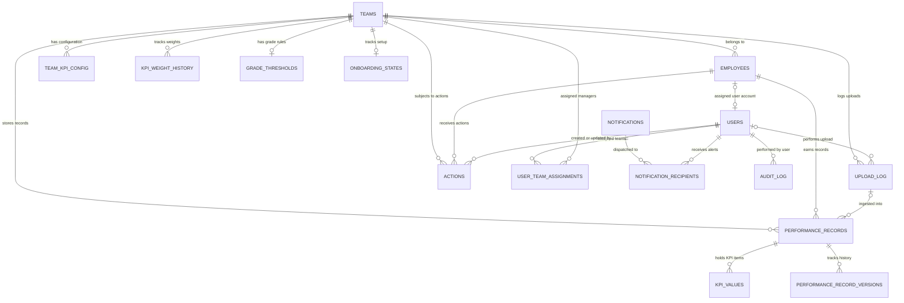

# Database Schema & Relationships Reference

This document serves as a complete reference for the PMS Dashboard database schema, tables, constraints, triggers, and entity-relationship mapping.

---

## Architecture Overview

The database is built on **PostgreSQL** (version 15+) and utilizes several advanced database capabilities:
1. **Table Partitioning**: The `performance_records` table is partitioned by the `year` column to optimize query times and table size as data grows.
2. **Materialized Views**: The summary data is pre-aggregated into a materialized view `mv_team_monthly_summary` to optimize executive dashboards and loaded concurrently for zero downtime.
3. **Database Triggers**: Used to enforce audit logs, automatic update timestamps, and team KPI weight validation rules.
4. **Row Level Security (RLS)**: Restricts manager view and operation scopes to their assigned teams while allowing Admin to see all.
5. **GIN Indexes**: Employed for full-text search capability on employee names.

---

## Entity-Relationship Diagram

The diagram below shows the relationships between tables:



---

## Database Type Mappings (Enums)

We define several custom Postgres Enums to enforce data integrity:

| Type Name | Allowed Values | Purpose |
| :--- | :--- | :--- |
| `user_role` | `Admin`, `Manager`, `Executive`, `Viewer` | Controls role-based access control (RBAC) levels |
| `access_level` | `read`, `write`, `admin` | Scopes team-manager permissions |
| `kpi_direction`| `higher_better`, `lower_better` | Direct vs inverse KPI scoring |
| `kpi_unit` | `%`, `currency`, `number`, `min` | Controls displaying format in the UI |
| `grade_class` | `A`, `B`, `C`, `D`, `E` | Scoring grades based on threshold calculations |
| `perf_status` | `Exceeds`, `Meets`, `Below` | Descriptive status tags for scores |
| `action_type` | `Training`, `Reward`, `PIP`, `Monitor`, `Coaching`, `Warning`, `Promotion` | Type of manager corrective action |
| `action_status`| `Open`, `In Progress`, `Completed`, `Cancelled` | Operational progress of interventions |
| `upload_status`| `pending`, `processing`, `success`, `failed` | Ingestion status of PMS workbooks |
| `notif_type` | `data_upload`, `action_recorded`, `grade_alert`, `system`, `warning` | Categorizes notifications |
| `audit_op` | `INSERT`, `UPDATE`, `DELETE`, `SOFT_DELETE` | Identifies change source in audit logs |

---

## Tables Detail

### 1. Configuration Tables

#### `teams`
Represents the core organizational team structures.
* `id` (`UUID`, Primary Key): Auto-generated unique identifier.
* `name` (`VARCHAR(100)`, Unique, Not Null): URL/Code-friendly name (e.g. `inbound_egy`).
* `db_name` (`VARCHAR(100)`, Unique, Not Null): UI-friendly or configuration name.
* `region` (`VARCHAR(10)`, Not Null, Default `'UAE'`): Active operating country region (e.g. `'EGY'`, `'UAE'`).
* `is_active` (`BOOLEAN`, Not Null, Default `TRUE`): Soft disable switch.
* `created_at` / `updated_at` (`TIMESTAMPTZ`): Timestamps.

#### `team_kpi_config`
Stores configuration properties for individual KPIs per team.
* `id` (`UUID`, Primary Key)
* `team_id` (`UUID`, Foreign Key referencing `teams.id`, Cascade Delete)
* `kpi_key` (`VARCHAR(50)`, Not Null): Code reference string (e.g. `nps`, `qa`).
* `kpi_label` (`VARCHAR(100)`, Not Null): UI Label text (e.g. `Quality Assurance`).
* `weight` (`NUMERIC(5,4)`, Not Null): Decimal weight (value in range `(0.0, 1.0]`).
* `direction` (`kpi_direction`, Not Null, Default `'higher_better'`)
* `unit` (`kpi_unit`, Not Null, Default `'%':code:`)
* `color` (`VARCHAR(20)`, Default `'#10B981'`): Hex code for styling UI charts.
* `actual_col` (`VARCHAR(100)`, Not Null): Column header text in the Excel sheet for actual values.
* `target_col` (`VARCHAR(100)`, Not Null): Column header text in the Excel sheet for target values.
* `achievement_col` (`VARCHAR(100)`): Excel sheet column if achievement is pre-computed.
* `volume_unit` (`VARCHAR(20)`): Metric volume context (e.g. `Calls`, `Cases`).
* `display_order` (`SMALLINT`, Default `0`): UI order sequence.

> [!IMPORTANT]
> The composite key `(team_id, kpi_key)` is unique. A trigger (`trg_kpi_weight_sum`) ensures that the sum of `weight` for any given team does not exceed `1.0` (100%).

#### `kpi_weight_history`
Tracks historic weight changes for auditing and performance consistency over time.
* `id` (`UUID`, Primary Key)
* `team_id` (`UUID`, Foreign Key referencing `teams.id`)
* `kpi_key` (`VARCHAR(50)`, Not Null)
* `old_weight` / `new_weight` (`NUMERIC(5,4)`)
* `changed_at` (`TIMESTAMPTZ`, Default `NOW()`)
* `changed_by` (`VARCHAR(100)`)
* `reason` (`TEXT`)

#### `grade_thresholds`
Calculates grade thresholds dynamically per team.
* `id` (`UUID`, Primary Key)
* `team_id` (`UUID`, Foreign Key referencing `teams.id`, Cascade Delete, Unique)
* `grade_a` (`NUMERIC(5,2)`, Default `95`): Threshold score for Grade A.
* `grade_b` (`NUMERIC(5,2)`, Default `85`): Threshold score for Grade B.
* `grade_c` (`NUMERIC(5,2)`, Default `75`): Threshold score for Grade C.
* `grade_d` (`NUMERIC(5,2)`, Default `65`): Threshold score for Grade D.

> [!NOTE]
> Scores below `grade_d` automatically receive Grade E. A check constraint guarantees that thresholds follow the order: `grade_a > grade_b > grade_c > grade_d > 0`.

---

### 2. Core Employees Table

#### `employees`
Contains employee metadata.
* `id` (`UUID`, Primary Key)
* `employee_id` (`VARCHAR(50)`, Unique, Not Null): The external organization ID imported from Excel sheets.
* `name` (`VARCHAR(255)`, Not Null): Full name.
* `team_id` (`UUID`, Foreign Key referencing `teams.id`, Restrict Delete)
* `region` (`VARCHAR(10)`, Default `'UAE'`)
* `is_active` (`BOOLEAN`, Default `TRUE`)

> [!TIP]
> A GIN index (`idx_employees_name_trgm`) is applied on the `name` column using `gin_trgm_ops` for fast trigram searches.

---

### 3. Performance & Logs

#### `upload_log`
Tracks history of Excel workbook uploads.
* `id` (`UUID`, Primary Key)
* `team_id` (`UUID`, Foreign Key referencing `teams.id`)
* `month` (`VARCHAR(20)`)
* `year` (`SMALLINT`)
* `record_count` (`INTEGER`, Default `0`)
* `uploaded_by_user_id` (`UUID`, Foreign Key referencing `users.id`)
* `status` (`upload_status`, Default `'pending'`)
* `error_message` (`TEXT`)
* `uploaded_at` (`TIMESTAMPTZ`)

#### `performance_records` (Partitioned)
Main record container for monthly scores.
* `id` (`UUID`, Not Null, Default `uuid_generate_v4()`)
* `employee_id` (`UUID`, Foreign Key referencing `employees.id`, Restrict Delete)
* `team_id` (`UUID`, Foreign Key referencing `teams.id`, Restrict Delete)
* `month` (`VARCHAR(20)`, Not Null)
* `year` (`SMALLINT`, Not Null, Primary / Partition Key)
* `score` (`NUMERIC(6,2)`, Not Null): The final calculated score, capped at 100.
* `grade` (`grade_class`, Not Null)
* `status` (`perf_status`, Not Null)
* `upload_id` (`UUID`, Foreign Key referencing `upload_log.id`, Set Null on Delete)
* `uploaded_at` (`TIMESTAMPTZ`, Default `NOW()`)

> [!WARNING]
> This table uses a composite Primary Key `(id, year)` to support native PostgreSQL range partitioning on the `year` column. Each year (e.g. 2020 through 2030) has a dedicated partition table (e.g. `performance_records_2026`).

#### `kpi_values`
Contains individual KPI details for each performance record.
* `id` (`UUID`, Primary Key)
* `record_id` (`UUID`, Not Null)
* `record_year` (`SMALLINT`, Not Null)
* `kpi_key` (`VARCHAR(50)`, Not Null)
* `actual_value` / `target_value` (`NUMERIC(18,4)`)
* `achievement_ratio` (`NUMERIC(10,4)`): Raw calculation ratio (actual / target).
* `weight_applied` (`NUMERIC(5,4)`): Weight config used during calculation.
* `contribution` (`NUMERIC(6,2)`): Effective score contributed (achievement ratio capped at 1.0 * weight).

> [!IMPORTANT]
> Since the parent `performance_records` uses a composite primary key, `kpi_values` links to it using a composite Foreign Key Constraint on `(record_id, record_year)` pointing to `performance_records(id, year)`.

#### `performance_record_versions`
Tracks change history when scores are updated manually by admins.
* `id` (`UUID`, Primary Key)
* `original_record_id` (`UUID`, Not Null)
* `original_record_year` (`SMALLINT`, Not Null)
* `version_number` (`INTEGER`, Not Null)
* `score` (`NUMERIC(6,2)`)
* `grade` (`VARCHAR(5)`)
* `status` (`VARCHAR(20)`)
* `changed_by_user_id` (`UUID`, Foreign Key referencing `users.id`)
* `changed_at` (`TIMESTAMPTZ`, Default `NOW()`)
* `change_reason` (`TEXT`)

---

### 4. Authentication & Security

#### `users`
Accounts that log into the dashboard.
* `id` (`UUID`, Primary Key)
* `employee_id` (`VARCHAR(50)`, Nullable): Links a user to their employee profile when available.
* `username` (`VARCHAR(100)`, Unique, Not Null)
* `email` (`VARCHAR(255)`, Unique, Not Null)
* `password_hash` (`TEXT`, Not Null)
* `role` (`user_role`, Default `'Viewer'`)
* `is_active` (`BOOLEAN`, Default `TRUE`)
* `last_login` (`TIMESTAMPTZ`)

User administration is managed through the `/api/users` router and persists directly to this table.

#### `user_team_assignments`
Associates managers with teams they are allowed to oversee.
* `id` (`UUID`, Primary Key)
* `user_id` (`UUID`, Foreign Key referencing `users.id`, Cascade Delete)
* `team_id` (`UUID`, Foreign Key referencing `teams.id`, Cascade Delete)
* `access_level` (`access_level`, Default `'read'`)
* `assigned_at` (`TIMESTAMPTZ`)
* `assigned_by` (`VARCHAR(100)`)

---

### 5. Interventions & Notifications

#### `actions`
Corrective plans, promotions, PIPs, or monitor actions set by managers for performance records.
* `id` (`UUID`, Primary Key)
* `employee_id` (`UUID`, Foreign Key referencing `employees.id`)
* `team_id` (`UUID`, Foreign Key referencing `teams.id`)
* `month` (`VARCHAR(20)`)
* `year` (`SMALLINT`)
* `action_type` (`action_type`, Not Null)
* `action_text` (`TEXT`, Not Null): Notes describing the action plan.
* `root_cause_note` (`TEXT`): Discovered root causes.
* `status` (`action_status`, Default `'Open'`)
* `created_by_user_id` (`UUID`, Foreign Key referencing `users.id`)
* `created_at` (`TIMESTAMPTZ`)

#### `notifications`
Real-time Socket.IO alert records.
* `id` (`UUID`, Primary Key)
* `type` (`notif_type`, Not Null)
* `title` / `message` (`VARCHAR`/`TEXT`)
* `room` (`VARCHAR(100)`): Destination room (e.g. `admin`, `team_inbound`).
* `payload` (`JSONB`): Meta payload.
* `created_at` (`TIMESTAMPTZ`)

#### `notification_recipients`
Junction table tracking read/unread status for each user target.
* `id` (`UUID`, Primary Key)
* `notification_id` (`UUID`, Foreign Key referencing `notifications.id`, Cascade Delete)
* `user_id` (`UUID`, Foreign Key referencing `users.id`, Cascade Delete)
* `is_read` (`BOOLEAN`, Default `FALSE`)
* `read_at` (`TIMESTAMPTZ`)

---

### 6. Audit & System Logs

#### `audit_log`
Chronological logging of changes.
* `id` (`UUID`, Primary Key)
* `table_name` (`VARCHAR(100)`)
* `operation` (`audit_op`)
* `record_id` (`UUID`)
* `old_values` (`JSONB`): Row snapshot prior to transaction.
* `new_values` (`JSONB`): Row snapshot post transaction.
* `performed_by_user_id` (`UUID`, Foreign Key referencing `users.id`)
* `performed_at` (`TIMESTAMPTZ`)
* `ip_address` (`INET`)

#### `onboarding_states`
Tracks team onboarding state-machine checklist progress.
* `id` (`UUID`, Primary Key)
* `team_id` (`UUID`, Foreign Key referencing `teams.id`, Cascade Delete, Unique)
* `current_step` (`INTEGER`, Default `0`)
* `status` (`VARCHAR(20)`, Default `'pending'`)
* `started_at` / `completed_at` (`TIMESTAMPTZ`)
* `last_error` (`TEXT`)

#### `error_logs`
Logs HTTP request errors and tracebacks.
* `id` (`UUID`, Primary Key)
* `request_id` (`VARCHAR(100)`)
* `endpoint` (`VARCHAR(255)`)
* `method` (`VARCHAR(10)`)
* `error_class` (`VARCHAR(100)`)
* `error_message` (`TEXT`)
* `stack_trace` (`TEXT`)
* `occurred_at` (`TIMESTAMPTZ`)

---

## Triggers and Functions Details

The database behavior is enhanced by several triggers:

1. **`trg_users_updated_at`, `trg_teams_updated_at`, etc.**: Calls `set_updated_at()` to auto-bump the `updated_at` column.
2. **`trg_kpi_weight_sum`**: Fires after inserts/updates on `team_kpi_config`. Calls `check_kpi_weights_sum()`, which raises an exception if the team's combined weights exceed `1.0`.
3. **`trg_audit_*` (Users, Teams, Employees, Performance, Actions, etc.)**: Logs all `INSERT`, `UPDATE`, and `DELETE` operations automatically into the `audit_log` table with field differential JSON blocks.
4. **`calculate_grade(p_score, p_team_id)`**: DB function to automatically grade score achievements relative to a specific team's configuration.

---

## Materialized View Details

#### `mv_team_monthly_summary`
Aggregates summary statistics by team, year, and month:
* Number of employees.
* Average, maximum, and minimum score.
* Counts per Grade (A, B, C, D, E).
* Status distributions (Exceeds vs Below count).
* Average KPI achievement ratio.

To refresh the view concurrently without locking readers:
```sql
SELECT refresh_dashboard_views();
-- executes: REFRESH MATERIALIZED VIEW CONCURRENTLY mv_team_monthly_summary;
```

---

## Security Policies (RLS)

Postgres Row Level Security (RLS) enforces access limitations at the database level:

```sql
-- Ensure users can only query their own record
CREATE POLICY users_self ON users FOR SELECT 
  USING (id = current_setting('app.current_user_id', true)::UUID);

-- Managers can only view employees belonging to their assigned teams
CREATE POLICY managers_view_employees ON employees FOR SELECT 
  USING (EXISTS (
    SELECT 1 FROM user_team_assignments uta 
    WHERE uta.user_id = current_setting('app.current_user_id', true)::UUID 
      AND uta.team_id = employees.team_id 
      AND uta.access_level IN ('read', 'write', 'admin')
  ));

-- Managers can only view performance records for their assigned teams
CREATE POLICY managers_view_performance ON performance_records FOR SELECT 
  USING (EXISTS (
    SELECT 1 FROM user_team_assignments uta 
    WHERE uta.user_id = current_setting('app.current_user_id', true)::UUID 
      AND uta.team_id = performance_records.team_id
  ));

```

> [!NOTE]
> Admin sessions are treated as global viewers in the current app/session layer, so they can receive the full notification stream while managers and agents remain scoped to their assigned access.
