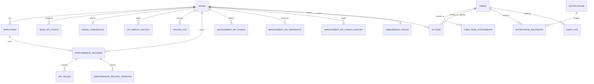

# Database Schema Reference

**Last verified:** July 6, 2026

Source of truth:

- ORM models: `Backend/models/models.py`
- Migrations: `Backend/migrations/`
- Team config JSON: `Backend/config/teams/`

This document focuses on the tables and relationships that are active in the current codebase, including the Management BSC persistence added for the modular Balanced Scorecard flow.

## Storage model

- PostgreSQL is the primary persistence store
- Redis is used for caching, with in-memory fallback in the app layer
- Team KPI metadata also exists in JSON under `Backend/config/teams/`
- Database-level RLS, materialized views, and trigger-based auditing are not the active enforcement path today

## Table groups

### Team and KPI configuration

| Table | Purpose |
| --- | --- |
| `teams` | Core team registry |
| `team_kpi_config` | Employee / Managerial / Corporate KPI config definitions |
| `grade_thresholds` | Per-team grade cutoffs |
| `kpi_weight_history` | Weight change history |

### Management BSC persistence

| Table | Purpose |
| --- | --- |
| `management_kpi_config` | Period-specific BSC target and weight config for `Managerial` / `Corporate` |
| `management_kpi_config_history` | Audit/history for uploaded or replaced management BSC config |
| `management_kpi_snapshots` | Measured KPI actuals for named managers / positions per period |

### People and monthly performance

| Table | Purpose |
| --- | --- |
| `employees` | Employee master records |
| `upload_log` | Workbook upload tracking |
| `performance_records` | Monthly performance header rows |
| `kpi_values` | KPI detail rows for each performance record |
| `performance_record_versions` | Version history for manually changed records |

### Access and security

| Table | Purpose |
| --- | --- |
| `users` | Login accounts |
| `user_team_assignments` | Team and level-based user scope |
| `role_permissions` | Role-to-permission mapping |

### Actions, notifications, and support

| Table | Purpose |
| --- | --- |
| `actions` | Corrective / coaching / reward actions |
| `notifications` | Notification events |
| `notification_recipients` | Per-user read state |
| `audit_log` | Application audit history |
| `onboarding_states` | Team onboarding progress |
| `error_logs` | Request error capture |

## Core relationships

## Key table notes

### `team_kpi_config`

- Holds the standard KPI metadata used by the employee dashboard and also by BSC-capable levels
- Unique scope: `(team_id, performance_level, kpi_key)`
- `performance_level` is constrained to `Employee`, `Managerial`, or `Corporate`
- Indexed by `(team_id, performance_level)`

### `management_kpi_config`

- Stores period-aware BSC target definitions for `Managerial` and `Corporate`
- Scope is either by `position_name` or by `employee_identifier`
- Uniqueness covers team, level, period, scope, and KPI key
- Used by `ManagementBSCService` to build the active Management Overview / Strategic Overview response

Important constraints:

- `performance_level` must be `Managerial` or `Corporate`
- exactly one of `position_name` or `employee_identifier` must be populated
- `weight > 0`

### `management_kpi_snapshots`

- Stores actual measured KPI values for a person and period
- Backing store for manager-specific KPI cards and Management Overview switching
- Unique per team, employee identifier, level, period, and KPI key

### `performance_records`

- Composite primary key: `(id, year)`
- This is partition-ready design, but still used as a single table today
- Indexed by `(team_id, performance_level, month, year)`
- Stores final score, grade, and status per employee per month

### `kpi_values`

- Child rows for `performance_records`
- Uses a composite foreign key to `(record_id, record_year)`
- Stores actual, target, raw achievement ratio, weight applied, and contribution

### `user_team_assignments`

- Defines team access scope
- `performance_level` may be `NULL` for legacy all-level scope, or set to `Employee`, `Managerial`, or `Corporate`
- Current application logic uses this table for API-level authorization, especially around BSC access

### `audit_log`

- JSON-compatible old/new value snapshots
- Foreign key to `users` through `performed_by`
- Application-level audit behavior is active even though DB trigger-based auditing is not the primary model

## Indexes and constraints worth knowing

Implemented in the models:

- `idx_kpi_config_team_level`
- `idx_management_kpi_config_lookup`
- `idx_management_kpi_config_batch`
- `idx_management_kpi_snapshot_lookup`
- `idx_management_kpi_snapshot_batch`
- `idx_employee_perf_level`
- `idx_perf_record_filters`
- `idx_management_kpi_config_history_team`
- `idx_management_kpi_config_history_batch`
- `idx_user_team_assignment_scope`

Important unique constraints:

- `uq_kpi_team_level_key`
- `uq_management_kpi_config_scope`
- `uq_management_kpi_snapshot_scope`
- `uq_role_permission`
- `uq_record_version`

## What is enforced in app code instead of DB-first features

Currently enforced mainly in services, middleware, or request logic:

- effective authorization and team/level scoping
- many audit decisions
- cache fallback behavior
- BSC response shaping and empty-state decisions
- team onboarding workflow progression

Not the active primary path today:

- PostgreSQL Row Level Security
- materialized summary views
- trigger-driven audit/write guards
- native partitioned `performance_records_*` child tables
