# System Architecture

This document provides a detailed overview of the core architectural patterns, technology stack, and data access strategies employed by the PMS Dashboard.

---

## 1. High-Level Architecture Overview

The PMS Dashboard is structured as a decoupled web application consisting of a single-page React frontend, a FastAPI REST & real-time API backend, a PostgreSQL relational database, and a Redis cache.

```mermaid
graph TD
    User([Browser Client])
    
    subgraph Frontend [React Application]
        UI[React UI Components]
        Store[Zustand Action Store]
        Query[TanStack Query Cache]
        SocketClient[Socket.IO Client]
    end
    
    subgraph Backend [FastAPI Application]
        API[FastAPI Router]
        Auth[Auth Middleware]
        SocketServer[Socket.IO Server]
        ServiceLayer[Service Layer]
        RepoLayer[Repository Layer]
        CacheService[Cache Service]
    end

    subgraph Data [Data Persistence]
        DB[(PostgreSQL DB)]
        Redis[(Redis Cache)]
        JSONFallback[JSON Fallback Files]
    end

    User <-->|HTTP / WebSockets| Frontend
    UI --> Store
    UI --> Query
    Store <-->|WS events| SocketClient
    Query <-->|REST Requests| API
    SocketClient <-->|Socket.IO Protocol| SocketServer
    
    API --> Auth
    Auth --> ServiceLayer
    SocketServer --> ServiceLayer
    
    ServiceLayer --> CacheService
    ServiceLayer --> RepoLayer
    
    CacheService <--> Redis
    RepoLayer <--> DB
    RepoLayer -.->|Read Fallback| JSONFallback
```

---

## 2. Technology Stack & Component Roles

### Frontend (React & TypeScript)
- **Role:** Implements the user interface, routing, state management, and real-time socket listeners.
- **Vite:** Local bundler and dev server.
- **TanStack Query:** Manages asynchronous data fetching, automatic query caching, and validation synchronization.
- **Zustand:** Light application store representing local UI states, action updates, and real-time alert logs.
- **Tailwind CSS:** Premium styling framework tailored with dark mode styling and subtle motion transitions.

### Backend (FastAPI & Python)
- **Role:** Handles Restful request/response routing, payload validation (Pydantic), token lifecycle (JWT), and real-time notifications.
- **SQLAlchemy:** SQL Toolkit and Object Relational Mapper (ORM) used to map database entities to Python classes.
- **python-socketio:** Integrates the Socket.IO transport layer over ASGI, allowing low-latency push events.

### Databases & Cache
- **PostgreSQL (v15+):** Primary source-of-truth transactional database. Enforces constraints (e.g. unique employee/month/year records) and indexes (GIN for text search).
- **Redis (v7):** Caching engine for query results and session validity checks.

---

## 3. Data Access Patterns

To ensure maximum performance and reliable offline capability, data access follows strict protocols:

### A. DB-First Reads
Every endpoint requesting dashboard or employee metrics queries the **PostgreSQL database first** (utilizing caches if active). The application reads performance records and KPI parameters directly from SQL tables.

### B. JSON Data Fallback
If the PostgreSQL database is unreachable or is completely empty (e.g., during initial setup or backup restoration), the repository layer intercepts the query and falls back to reading static pre-seeded JSON data files (located in `Backend/data/`). This ensures the dashboard remains functional even in restricted environments.

### C. Repositories Pattern
All database-specific interactions are isolated inside repositories (`Backend/repositories/`). The API and Service layers remain database-agnostic, referring only to abstract repository interfaces (e.g., `EmployeeRepository`, `PerformanceRepository`).

### B. Service Layer Isolation
Business logic, scoring calculations, Excel workbook operations, and alerts are encapsulated inside services (`Backend/services/`). Routers never interact directly with database models or perform calculations themselves.
