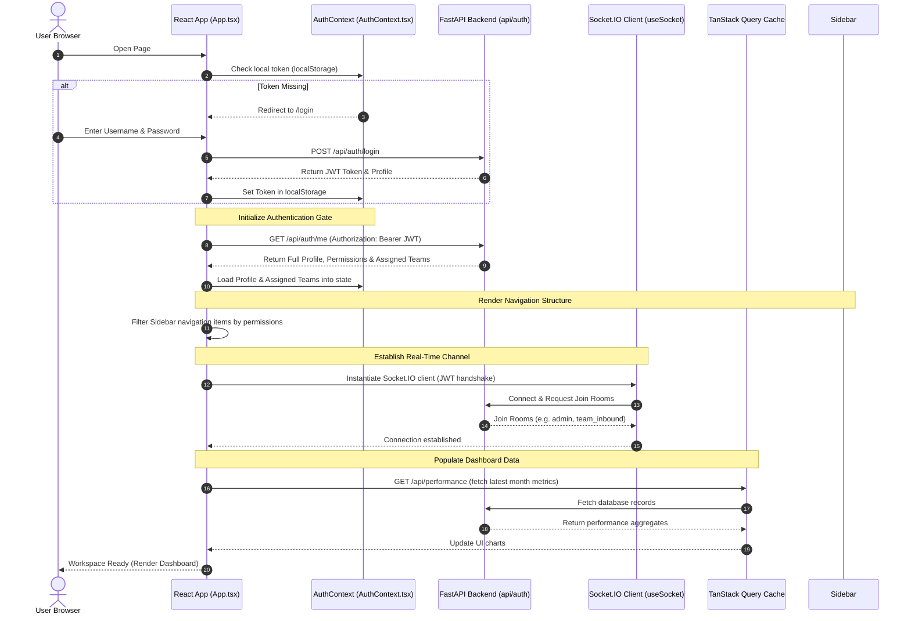

# Frontend Bootstrapping & Initialization Flow

This document details the startup, authentication, and connection sequence executed by the React client application when bootstrapping.

---

## 1. Initialization Sequence Diagram

The sequence diagram below shows the startup steps, beginning with the login interface and ending with a fully active team dashboard:

---

## 2. Dynamic Initialization Gate

To prevent flash-of-unstyled-content (FOUC), unauthorized rendering, or API failures due to race conditions, the React application enforces a strict **Authentication Gate**:

### Why Initialization is Gated
1. **Permission Validation:** The client application does not know which sidebar navigation buttons (such as Settings, Planning, or Team Management) to display until it resolves user permissions via `/api/auth/me`.
2. **Data Fetching Scopes:** The application is unable to fetch team performance metrics until it verifies which teams the manager has permission to access.
3. **Socket Subscription:** The real-time listener cannot subscribe to the correct WebSocket rooms without knowing the active user's role and assigned teams.

### How Race Conditions are Avoided
- **Render Blocking:** The main application shell (`App.tsx`) monitors an `initializing` state variable from the `AuthContext`. If `initializing` is true, the app halts route routing and renders a full-screen skeleton loading interface.
- **Sequential Execution:** The Socket.IO connection is initialized only *after* the authentication profile has resolved successfully, ensuring the client has a valid JWT to present during the socket handshake.
- **Declarative Router Guards:** Private routes are wrapped in a `<ProtectedRoute>` wrapper that automatically intercepts attempts to bypass initialization, redirecting unauthorized browsers back to `/login`.
