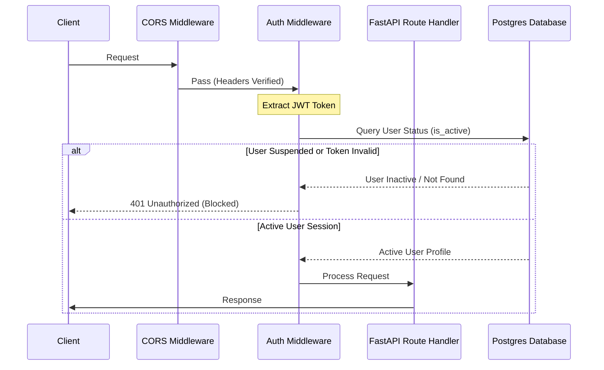

# Backend Architecture

This document describes the design, directory layout, routing patterns, middleware operations, and data schemas of the FastAPI backend application.

---

## 1. Directory Layout

The `Backend/` workspace is organized into modular layers:

```text
Backend/
|-- api/
|   |-- middleware/          # Security, authorization, and exception handlers
|   |-- routers/             # API request routing modules
|   `-- dependencies.py      # FastAPI Dependency Injection (DI) providers
|-- config/                  # Server configuration, database connections, loggers
|-- data/                    # JSON database seed and fallback records
|-- Data_Cleaning_Teams/     # Team-specific Excel workbook parsing routines
|-- data_cleaning/           # Core ingestion helper classes and factory mapper
|-- models/                  # SQLAlchemy ORM models and Pydantic validation schemas
|-- repositories/            # SQL/JSON data access layers (DAL)
|-- services/                # Core business, calculation, caching, and notification services
`-- app.py                   # Main FastAPI entry point and Socket.IO mount
```

---

## 2. Dependency Injection (DI)

FastAPI's dependency injection engine is utilized to inject database sessions, configuration instances, and repository objects into route handlers.

**Key Dependencies (`Backend/api/dependencies.py`):**
- `get_db`: Yields database sessions managed under SQLAlchemy connection pools.
- `current_user`: Extracts, decodes, and validates JWT headers to resolve the requesting active `User` account.
- `require_permission(permission)`: Verifies role capabilities.
- Repository injection (`performance_repo`, `employee_repo`, `weights_repo`): Injects active database repositories with fallback capabilities.

---

## 3. Middleware Architecture

The backend implements custom ASGI middleware to secure endpoints and capture performance telemetry:



- **CORS Middleware:** Standardizes origin access configurations (controlled by environment settings).
- **Authentication Middleware (`auth_middleware.py`):** Parses incoming JWT tokens. Ensures that if an account has been suspended or deactivated (`is_active = false`), its active session is terminated instantly.
- **RBAC Middleware:** Asserts that the decoded user token role (Admin, Manager, Executive, Viewer) possesses the rights required for the requested route path.

---

## 4. Models and Validation Schemas

Data representation is divided into two separate models:

### Persistence Models (SQLAlchemy ORM)
- Defined in `Backend/models/models.py` and `models/team_models.py`.
- Map directly to physical Postgres tables.
- Contain relationships, constraints, indexes, and custom enums.

### Ingestion & Response Models (Pydantic)
- Defined in `Backend/models/schemas.py`.
- Validate client requests and sanitize server response payloads.
- Guarantee type compliance (e.g., email syntax formatting).

---

## 5. Startup & Initialization Hook

Upon application launch (`app.py` startup event):
1. **Migrations Check:** Connects to PostgreSQL and applies Alembic migrations if any pending revisions exist.
2. **Configuration Load:** Reads team configs from `config/teams/*.json` to populate memory config indices.
3. **Database Seeding:** Automatically checks if default permissions, roles, and administrative users (e.g., `super` Admin account) are present. If missing, it seeds them into the database tables.
