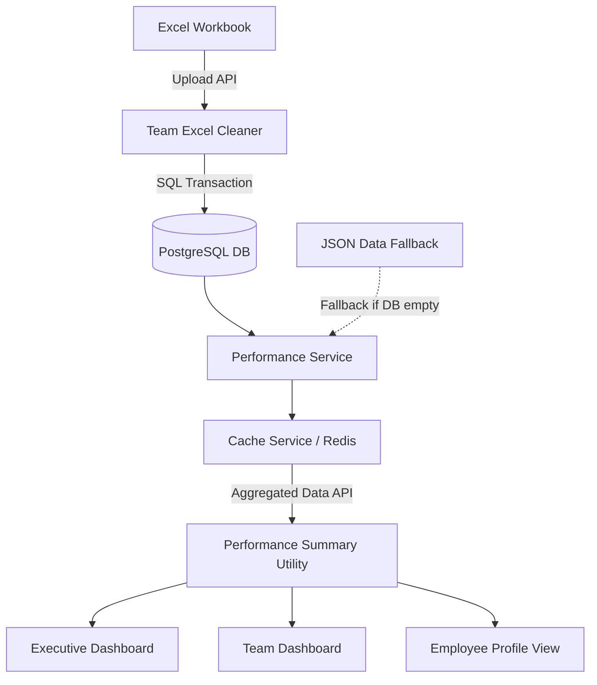

# Dashboard Data & Calculation Flow

This document maps the workflow of performance data, from raw workbook loading to UI visualization in the Executive and Team views.

---

## 1. Complete Data Lifecycle

The diagram below maps how performance records traverse the backend logic and are rendered in the frontend components:

---

## 2. Processing Stages Explained

### Ingestion & Normalization
1. **Raw Workbook:** Excel sheets containing raw call volumes, handling times, actual counts, and targets are uploaded.
2. **Team Excel Cleaner:** Cleans, extracts, and normalizes values to ensure standard metrics.
3. **Database Save:** Data is saved to PostgreSQL, establishing relational constraints.

### Query & Cache Retrieval
4. **Performance Service:** Handles request routing. Uses the database-first read path to load records, falling back to local JSON data files only if database tables are empty.
5. **Cache Service:** Stores results in Redis (or in-memory fallback) to minimize SQL database query execution times on subsequent page reloads.

### Aggregation & UI Binding
6. **Performance Summary Utility:** Summarizes performance parameters (e.g. average team scores, count of agents meeting expectations, grade counts).
7. **Executive Dashboard:** Displays organizational summary KPIs, headcount cards, and overall team performance rankings.
8. **Team Dashboard:** Displays team-specific metrics, details of individual KPIs (Attendance, Booking, AHT, Utilization), and roster grids.
9. **Employee Profile:** Renders personal performance history, historic grade changes, manager notes, and action plans.

---

## 3. UI Filtering & Default-Month Selection

To guarantee a clean initial state, the dashboard follows specific filtering logic:

- **Default Month Filter:** The dashboard automatically selects the **latest month containing active performance records** (e.g., if May data was recently loaded, the dashboard defaults to May).
- **All Months Aggregation:** Users can explicitly select "All" from the month filter. When selected, the UI aggregates performance averages across all months.
- **Headcount Warning:** Aggregating agents across multiple months results in count duplication (e.g. 5 monthly records for 1 agent looks like 5 agents). To prevent misinterpretation, the "Total Agents" card displays the headcount of the latest month only and shows a warning footnote explaining this context.
