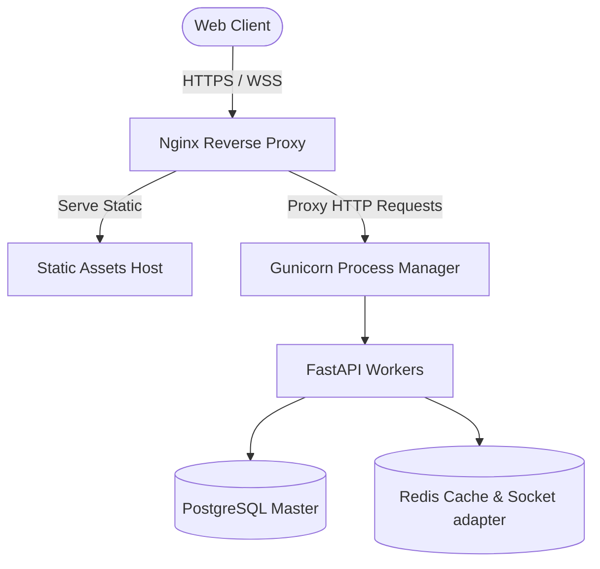

# Deployment & Infrastructure Operations

This document describes how to deploy the PMS Dashboard in development and staging/production configurations, manage database operations, scale resources, and configure monitoring.

---

## 1. Development Deployment (Docker Compose)

For development or local testing, the application is packaged into a Docker Compose configuration.

### Services Provisioned
1. **`db` (PostgreSQL 15):** Exposes transactional port `5432`.
2. **`redis` (Redis 7):** Exposes cache port `6379`.
3. **`backend` (FastAPI + Socket.IO):** Runs on port `7860`.

### Launching the Stack
1. Set up your `.env` file in the root workspace.
2. Run:
   ```bash
   docker compose up --build
   ```
3. Initialize the database schema (run Alembic migrations):
   ```bash
   docker compose exec backend alembic upgrade head
   ```

---

## 2. Production Deployment (Proposed Stack)

To transition from a "stable development candidate" to a production environment, the following stack is recommended:



### A. Reverse Proxy (Nginx)
- Configured to handle SSL/TLS termination.
- Serves static compiled assets directly.
- Redirects `/api` HTTP and WebSocket traffic to Gunicorn.

### B. WSGI/ASGI Server (Gunicorn & Uvicorn)
- Manages process isolation for FastAPI workers.
- Recommended configuration utilizes Gunicorn as the process coordinator running Uvicorn ASGI workers:
  ```bash
  gunicorn app:app -k uvicorn.workers.UvicornWorker -w 4 --bind 127.0.0.1:8000
  ```

---

## 3. Database Maintenance (Backups & Restores)

To ensure data retention, automated backups are necessary:

### Creating Logical Backups
Run `pg_dump` to create SQL-based transaction dumps:
```bash
pg_dump -U postgres -d PMS_Sys -F c -b -v -f /backups/pms_sys_backup.dump
```

### Restoring Backups
```bash
pg_restore -U postgres -d PMS_Sys -v /backups/pms_sys_backup.dump
```

---

## 4. Scalability & Load Management

As the user base expands, the architecture is ready for horizontal scaling:

- **Database Partitioning [Planned]:** Range-partitioning historical records by year inside PostgreSQL to maintain indexing efficiency.
- **Socket.IO Scaling [Planned]:** Utilizing the `Redis adapter` for python-socketio. This synchronizes notifications across multiple container instances by using Redis Pub/Sub, so users stay connected regardless of which specific API worker holds their active WebSocket connection.
- **Background Task Workers [Planned]:** Moving Excel processing tasks off FastAPI request loops and running them in separate background queues (such as Celery or RQ workers).

---

## 5. Monitoring & Observability Metrics

The application exposes standard endpoints to monitor infrastructure health:

- **Health Probe (`/api/health`):** Verifies connection and logs ping latencies for both PostgreSQL and Redis.
- **FastAPI Telemetry [Planned]:** Exposing a `/metrics` Prometheus endpoint to count response codes, request durations, and execution exceptions.
- **Error Tracking [Planned]:** Logging application crashes directly to centralized tools like Sentry.
