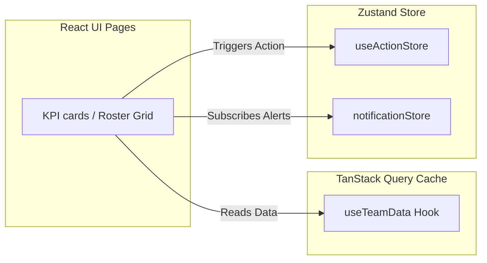

# Frontend Architecture

This document describes the design patterns, application structure, routing mechanisms, and state modules of the single-page React frontend application.

---

## 1. Directory Structure

The frontend application code is placed in `Frontend/src/` and follows a structured layout:

```text
Frontend/src/
|-- components/
|   |-- common/          # Sidebar, Header, custom Skeleton Loaders
|   |-- employee/        # KPI Breakdown, Action History, Notes panels
|   `-- team/            # Team KPI Cards, Roster Grids, Charts Sections
|-- constants/           # Shared grades constants (A, B, C, D, E)
|-- context/             # Authentication, Scoped Roles, Theme Providers
|-- data/                # Fallback bundled JSON records
|-- hooks/
|   |-- api/             # TanStack Query API caching hooks (useKpiWeights, etc.)
|   `-- URL/             # URL state binding hooks (useMonthParam, useLocationParam)
|-- lib/                 # Core API Client (axios wrapper) and Query Client
|-- pages/               # Route-level Page Components
|-- store/               # Zustand store modules (useActionStore, notificationStore)
|-- utils/               # KPI scoring helpers and shared summary utilities
|-- App.tsx              # Application shell, router maps, and auth guards
`-- main.tsx             # DOM injection entry point
```

---

## 2. Navigation & Role-Based Sidebar

The sidebar navigation links adapt dynamically based on the current logged-in user's role.

- **Admin:** Receives full visibility including `Executive View`, `Team Dashboards`, `Planning View`, `Team Management`, and `Settings`.
- **Manager / Executive:** Receives `Executive View`, `Team Dashboards`, `Planning View`, and `Settings`. (Hidden from `Team Management`).
- **Viewer / Agent:** Scoped strictly to `Executive View`, assigned `Team Dashboard`, and personal `Employee Profile`. `Planning View` and `Settings` are filtered out.

These checks are repeated at the route-guard level (`src/App.tsx`) to prevent direct URL access bypass attempts.

---

## 3. Application State Architecture

State is split between client cache, WebSocket logs, and lightweight actions stores:



### Server Cache (TanStack Query)
- Coordinates API fetching from the FastAPI endpoints.
- Caches results (e.g., weights list has 30 minutes staleTime) to minimize network overhead.
- Automatically handles query retries and validation updates.

### Actions Store (Zustand)
- Coordinates local action status tracking (such as recording training, monitor status, or PIP actions).
- Provides instant optimistic UI updates on updates.

### URL Parameter Binding (Custom hooks)
- URL-parameter hooks (`useMonthParam`, `useLocationParam`) bind dropdown selections to the browser search parameters.
- Reloading the page or sharing dashboard links preserves the exact selected filters (e.g., region, month, branch location).

---

## 4. Shared Performance Summary Utility

The frontend shares calculation logic with the backend to summarize grades and status counts.
- **File:** `src/utils/performanceSummary.js`
- **Aggregation:** Groups performance records to calculate the average score, class A/B percentage, and class D/E counts across the selected scope.
- **Headcount Warning Integration:** When the dashboard filter Month = All is selected, this utility aggregates records over all months. The UI intercepts this to display latest-month unique headcount inside the `Total Agents` card to prevent misinterpretation of aggregated record counts.
