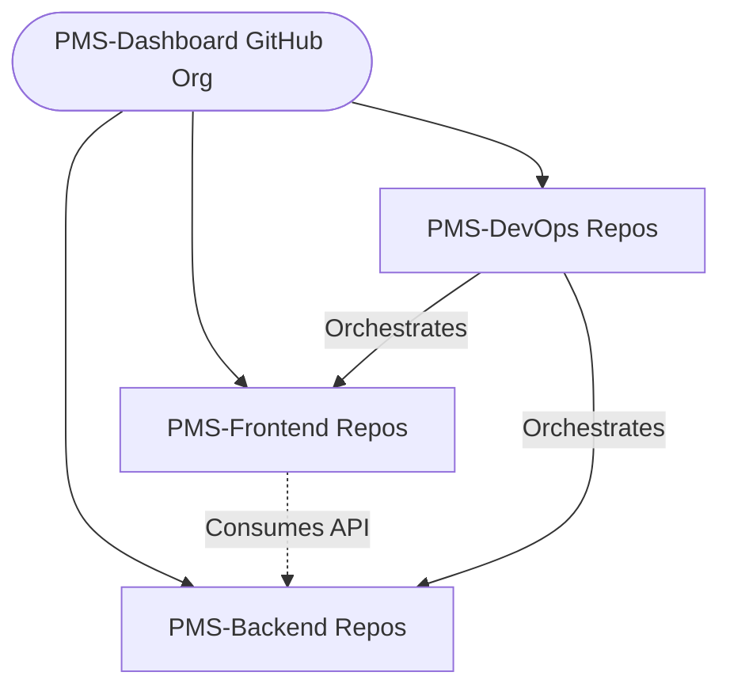

# Git Branching Strategy & Workflow Guide

This document defines the official Git branching strategy, repository structure, and release management workflows for the PMS Dashboard project.

---

## 1. Project Repository Structure

To maintain clean separation of concerns, improve CI/CD pipeline speed, and isolate deployment configurations, the project is structured as a multi-repository ecosystem housed under a single GitHub Organization.

```
PMS-Dashboard (GitHub Organization)
│
├── PMS-Frontend      - Single-page React + TypeScript frontend client application.
├── PMS-Backend       - FastAPI REST & Socket.IO Python application server.
└── PMS-DevOps        - Docker Compose, Helm charts, Nginx configs, and CI/CD pipelines.
```

### Why a Multi-Repository Structure?
- **Independent Deployments:** Frontend assets can be compiled and pushed to CDNs (e.g. Vercel, Cloudflare Pages) without redeploying backend containers.
- **Access Control Isolation:** Frontend designers, API engineers, and DevOps/SREs are granted repository access scoped to their exact duties.
- **Faster CI/CD Pipelines:** Tests and lint runs execute only on files changed within their specific context, dramatically shortening build times.

---

## 2. Mermaid Workflow Diagrams

### Repository Structure Mapping


### Branch Strategy & Promotion Paths


### Hotfix Workflow


---

## 3. Branching Strategy Definition

The project utilizes a hybrid Git-Flow strategy optimized for continuous integration and enterprise stability.

| Branch Name | Source Branch | Destination | Target Audience | Lifespan | Purpose |
| :--- | :--- | :--- | :--- | :--- | :--- |
| `main` | N/A | Production | Release Managers | Permanent | Production-ready state. Only contains fully validated releases. |
| `develop` | `main` | `main` (via Release) | Core Developers | Permanent | Integration branch for daily development. Must always remain buildable. |
| `release/v*` | `develop` | `main` & `develop` | QA & DevOps | Temporary | Preparation of production release candidate. Only bugfixes allowed. |
| `feature/*` | `develop` | `develop` | Feature Engineers | Short-Lived | Development of a specific task, issue, or feature. |
| `hotfix/*` | `main` | `main` & `develop` | DevOps / Hotfixers | Short-Lived | Urgent production bug fixes that cannot wait for the next release. |

---

## 4. Operational Workflows & Commands

### Initial Repository Bootstrapping
Run once at the start of a version milestone to set up base branches:
```bash
# Clone and synchronize master branch
git checkout main
git pull origin main

# Create and publish develop branch
git checkout -b develop
git push -u origin develop

# Create and publish release candidate branch
git checkout -b release/v2.0
git push -u origin release/v2.0

# Return to active development
git checkout develop
```

---

### Feature Lifecycle (Branch, Commit, Merge)

#### A. Creating the Feature Branch
Create feature branches only when starting work. Keep them short-lived (merge within 3–5 days).
```bash
git checkout develop
git pull origin develop

# Branch out for infrastructure work
git checkout -b feature/infrastructure
git push -u origin feature/infrastructure
```

#### B. Merging Feature into Develop
Do not merge features directly to main. Push changes, verify CI build checks pass, and merge:
```bash
# Switch and pull latest develop changes
git checkout develop
git pull origin develop

# Merge feature locally
git merge feature/infrastructure --no-ff

# Publish updated develop branch
git push origin develop
```

#### C. Deleting Short-Lived Branches
Immediately remove branches after merging to prevent repository pollution:
```bash
# Delete local branch
git branch -d feature/infrastructure

# Delete remote branch
git push origin --delete feature/infrastructure
```

---

### Release Candidate Workflow

#### A. Spawning Release Candidate
When develop features stabilize for the next milestone, freeze features:
```bash
git checkout develop
git pull origin develop
git checkout -b release/v2.1
```
*During this phase: Regression tests are run, and only bug fixes are committed to `release/v2.1`.*

#### B. Merging Release to Production
Once validated, deploy the release to production:
```bash
# Merge into production
git checkout main
git pull origin main
git merge release/v2.1 --no-ff
git push origin main

# Tag release
git tag -a v2.1-infrastructure -m "Infrastructure Hardening Enterprise Stable Release v2.1"
git push origin v2.1-enterprise --tags

# Sync release bugfixes back into develop
git checkout develop
git pull origin develop
git merge release/v2.1 --no-ff
git push origin develop

# Clean up release branch
git branch -d release/v2.1
git push origin --delete release/v2.1
```

---

### Urgent Production Hotfixes

If a bug crashes production, bypass the normal develop cycle:
```bash
# Pull production code
git checkout main
git pull origin main

# Branch out for immediate fix
git checkout -b hotfix/login-session
```
*Apply the fix, run test suites, and commit.*
```bash
# Merge hotfix into main
git checkout main
git merge hotfix/login-session --no-ff
git tag -a v2.0.1-patch -m "Production hotfix for session token timeouts"
git push origin main --tags

# Merge hotfix into develop to keep development in sync
git checkout develop
git merge hotfix/login-session --no-ff
git push origin develop

# Delete hotfix branch
git branch -d hotfix/login-session
git push origin --delete hotfix/login-session
```

---

## 5. Versioning Strategy Roadmap

The project follows strict Semantic Versioning (`vMAJOR.MINOR.PATCH`):
- `v2.0` (Enterprise Candidate) — Unified configurations and initial stable guides.
- `v2.1` (Infrastructure Hardening) — Dynamic pooling, readiness probes, and env overrides.
- `v2.2` (Monitoring & Observability) — Prometheus, Grafana dashboards, Loki log shipping.
- `v2.3` (Security Hardening) — JWT blacklisting, rate limiting, and password policy constraints.
- `v2.4` (Performance Optimizations) — Materialized views, Redis WS adapters, query analysis.
- `v2.5` (Background Workers) — Celery integration, async Excel cleaning.
- `v2.6` (UX Polish) — Skeleton loaders, keyboard shortcut triggers, table grids styling.
- `v2.7` (Mobile Support) — Responsive app shells.
- `v3.0` (Production Ready Release) — Complete validated production-hardened platform.

---

## 6. Git Best Practices & Anti-Patterns

### Best Practices (Do)
- **Never commit directly to `main` or `develop`.** Always use pull requests.
- **Protect `main` and `develop` branches** in GitHub settings (require pull request reviews and status checks to pass before merging).
- **Synchronize frontend and backend versions** using matching tags (e.g. backend `v2.1-infrastructure` matches frontend `v2.1-infrastructure`).
- **Keep commits small and single-purpose.** A commit should represent a single logical adjustment.

### Common Mistakes (Don't)
- **Avoid Long-Lived Feature Branches.** Branches active for weeks lead to massive merge conflicts.
- **Never Force Push (`git push -f`)** to shared branches (`main`, `develop`).
- **Do Not delete release candidate branches early** before testing, validation, and tags are fully pushed to production.
- **Never ignore pulling latest updates** (`git pull`) before branching out feature work.

---

## 7. Pre-Release Engineering Checklist

Before merging a release into `main`, verify:

- [ ] **Automated Tests:** All unit and integration test suites return green.
- [ ] **Production Build:** Bundle builds complete successfully without compiler or syntax errors.
- [ ] **Documentation:** README index list, project layouts, and architecture deep-dives are updated.
- [ ] **Version Bump:** Application version in config/manifest files is updated.
- [ ] **Release Tag:** Git version tag is created and prepared for push.
- [ ] **Deployment Backups:** Database logical schemas and volume snapshots are verified.
- [ ] **Rollback Sanity:** Rollback scripts are verified to revert schema changes.
