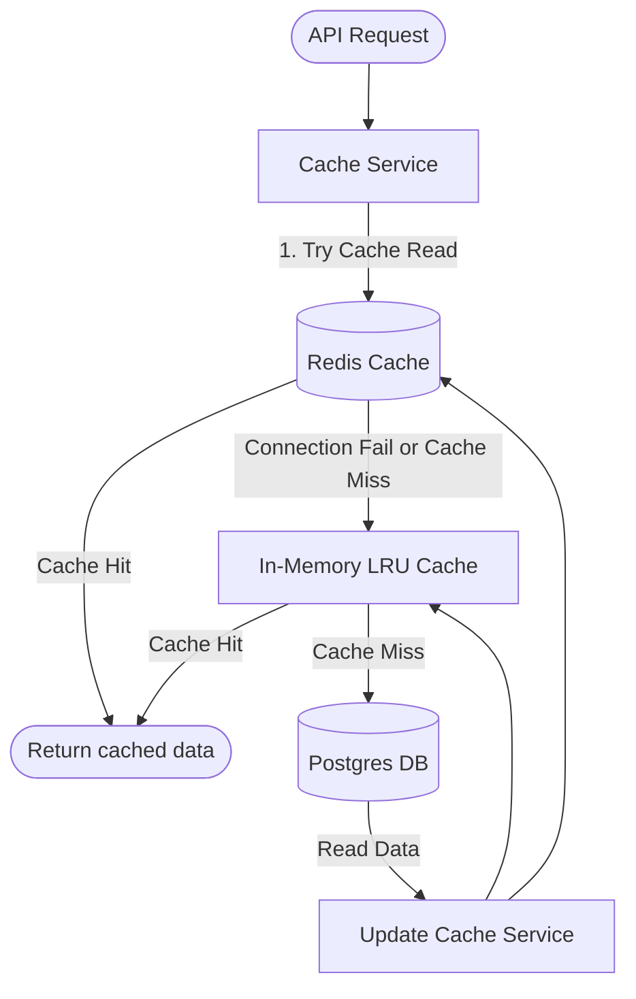

# Infrastructure & Persistence Layer

This document details the database configurations, indexing strategies, Redis caching lifecycle, fallbacks, and Docker Compose development environment setups.

---

## 1. Relational Database Strategy (PostgreSQL)

The primary database runs on PostgreSQL (v15+). Schema definitions are version-controlled using Alembic migrations.

### Core Schema Design Choices
- **Composite Primary Keys:** Table `performance_records` uses `(id, year)` as its primary key. This design is partition-ready, supporting database range partitioning by year.
- **Junction Foreign Keys:** Auxiliary table `kpi_values` maintains a composite foreign key on `(record_id, record_year)` pointing directly to the partitioned parent table keys.
- **Unique Performance Constraint:** A unique composite constraint on `(employee_id, month, year)` inside `performance_records` guarantees that duplicate metrics cannot be loaded for an employee in the same month.

### Database Indexing Strategy
- **GIN Indexes:** Applied on the employees `name` column using Postgres trigrams (`idx_employees_name_trgm`) to support high-speed partial text queries and type-ahead employee searches. Also applied on `audit_log` JSONB fields to optimize diff tracking.
- **Composite Indexes:** Key queries are optimized via composite indexing (e.g., `(team_id, year, month)`).

---

## 2. Caching Strategy (Redis & LRU Fallback)

To handle high dashboard load, a structured cache layer is implemented.

### Redis Integration [Implemented]
- Performance records, user sessions, and team configs are stored in Redis (v7) with specific expiration policies (e.g., 30-minute stale timeouts).
- **Proactive Invalidation:** When a new Excel workbook is uploaded or an employee's profile is updated, cache invalidation keys (`performance:<id>:*`) are deleted, and invalidation messages are dispatched to synched clients.

### Transparent In-Memory Fallback [Implemented]
- If the Redis connection drops, the cache wrapper catches the connection exception, logs a warning, and falls back to a local in-memory LRU cache.
- The backend remains functional, maintaining telemetry without interrupting the user experience.

---

## 3. Local Docker Compose Environment

The project provides a standardized local stack using `docker-compose.yml`:
- **API Container:** Builds `Backend/Dockerfile` and exposes port `7860`.
- **Database Container:** Provisions PostgreSQL (exposes `5432`).
- **Cache Container:** Provisions Redis (exposes `6379`).

*Note:* Development configurations inside the Compose file utilize default credentials and are intended for isolated sandboxed environments. In production, these must be overridden by environment variables.
