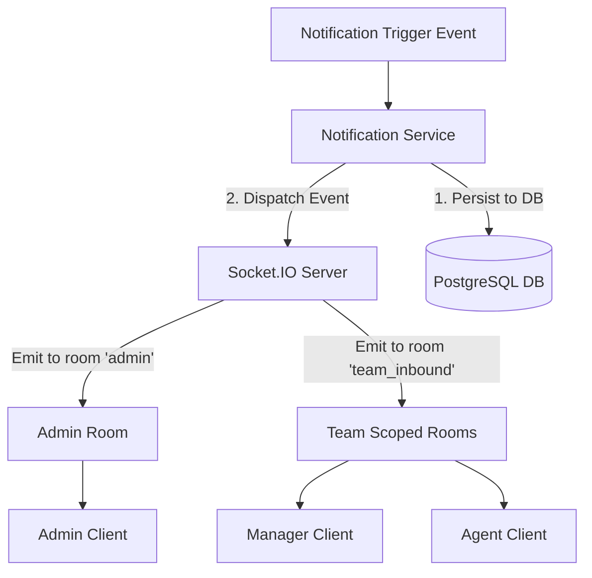

# Notification Architecture

This document describes the design, transport layer, connection rooms, delivery rules, and persistence layer of the real-time notification system.

---

## 1. Architectural Overview

Real-time notifications are powered by the **Socket.IO protocol**, implemented via a python-socketio integration over the FastAPI ASGI application on the backend and socket.io-client on the frontend.



---

## 2. Notification Service & Transport Separation

The notification architecture separates persistence logic from transport protocols:
- **`NotificationService` (Logic & Database):** Saves incoming alerts to the PostgreSQL `notifications` and `notification_recipients` tables. It tracks read/unread flags per user.
- **Socket.IO (Transport):** Broadcasts real-time events to active browser sockets. If a user is offline, the persistent database records ensure they can view their notifications when they log back in.

---

## 3. Scoped Connection Rooms

To secure alert delivery and prevent data leakage, sockets join specific communication rooms upon authentication:

- **`admin` Room:** Admin sessions join this room to receive the global notifications stream (e.g. system logs, audit notifications, data ingestion alerts).
- **`team_<team_id>` Rooms:** Scoped rooms. Managers and agents join rooms matching their assigned team IDs (e.g. `team_inbound`, `team_coding`).
- **`user_<user_id>` Rooms:** Private channels for direct notifications to specific users.

---

## 4. Connection Resiliency & Reconnect Logic

- **Heartbeats & Ping Intervals:** The connection maintains a standard ping-pong window to detect network disconnects.
- **Automatic Reconnection:** The frontend Socket.IO client is configured to retry connections if disconnected:
  ```ts
  const socket = io(SOCKET_URL, {
    reconnection: true,
    reconnectionAttempts: 10,
    reconnectionDelay: 1000,
    reconnectionDelayMax: 5000,
  });
  ```
- **Room Re-association:** Upon reconnecting, the backend automatically reassesses user session tokens and re-joins the rooms.

---

## 5. Horizontal Scale-Out Strategy [Planned]

The current server uses an in-process socket manager. In the upcoming scalability phase, this will be upgraded to support multi-worker clusters:
- **Redis Adapter Integration:** A Redis Socket.IO adapter will coordinate events between multiple backend application instances.
- **Pub/Sub Broker:** Socket event emits will be published to a Redis Pub/Sub channel, ensuring all instances sync and broadcast alerts to their active connected clients.
