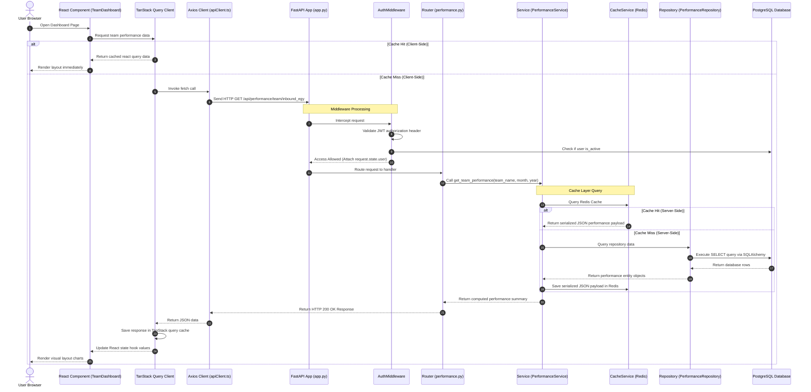

# Request Lifecycle

This document describes the request/response execution lifecycle of a typical query in the PMS Dashboard.

---

## 1. Request Lifecycle Sequence Diagram

The sequence diagram below shows the execution path of a user fetching dashboard reports, passing through the client layers, backend middlewares, services, repositories, cache, and database layers:

---

## 2. Layer-by-Layer Request Execution Guide

### Client-Side (React Application)
1. **React Component:** UI page triggers state request hook (e.g. `useTeamPerformance(teamId, month)`).
2. **TanStack Query:** Checks if local client query cache exists and is fresh. If stale or missing, invokes the API call.
3. **Axios Client:** Attaches JWT credentials from localStorage into the `Authorization: Bearer <token>` header, serializes payload parameters, and fires the HTTP request.

### Backend Routing & Middleware (FastAPI)
4. **FastAPI App Lifecycle:** Receives request and processes through the middleware chain in order.
5. **AuthMiddleware:** Parses headers. If token is invalid or user is suspended (`is_active = false`), aborts the request, returning a `401 Unauthorized` response immediately.
6. **FastAPI Router:** Matches URL route parameters to the handler function (e.g. `get_team_performance_endpoint`).

### Logic, Cache, and Persistence (Service & Repository)
7. **Service Layer:** Houses scoring calculators, cleaning rules, and coordinates data access. It first checks Redis cache tables.
8. **Cache Service:** Handles server-side Redis interactions, converting queries to cache keys (e.g. `pms:cache:team_perf:inbound_egy:May:2024`).
9. **Repository Layer:** Abstract database accessor layer. If a cache miss occurs, the repository uses SQLAlchemy models to query PostgreSQL.
10. **PostgreSQL Database:** Executes SQL statements utilizing indexes, returning relational records. If PostgreSQL is offline, the repository layer catches the error and reads fallback JSON seed files from disk.

### Response & Render Lifecycle
11. **Serialization:** FastAPI converts Pydantic objects or python structures into standardized JSON.
12. **React Cache Update:** TanStack Query updates its query tables, triggers components subscription re-renders, and updates the local view components.
