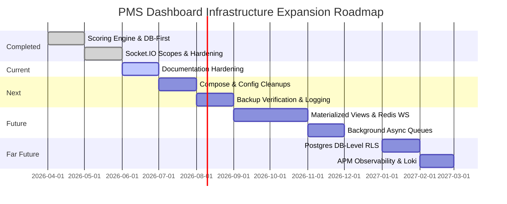

# Project Roadmap

This document outlines the milestones and roadmap phases for the PMS Dashboard, transitioning the current stable development release into a highly scalable, secure, and production-hardened system.

---

## Roadmap Overview

---

## 1. Completed Milestones

The core PMS Dashboard is functionally complete and validated under a stable development profile.

- **Dynamic KPI Team Configuration:** Migration from hardcoded team logic to an extensible JSON-driven layout inside `Backend/config/teams/`.
- **Database-First Read Path:** Unified reading strategy query starts at PostgreSQL via SQLAlchemy ORM, removing dependency on JSON files except as fallbacks.
- **Transparent JSON Repository Fallbacks:** Fail-safe read layer in `repositories/` loading static seed data if PostgreSQL is down or unpopulated.
- **Unified KPI Scoring Engine:** Normalized scoring algorithm (Direct/Inverse KPI Achievement, Effective capping at 100%, Weights, and Grade distributions).
- **Session Security for Suspended Users:** Middleware validation that instantly revokes active JWT sessions for users deactivated (`is_active = false`) in the database.
- **Real-Time Notification Scoping:** Real-time push alerts via Socket.IO, dividing clients into Admin global scopes and Manager/Agent scoped team rooms.
- **Frontend App Shell Hardening:** Integrated React error boundaries to isolate component failures and best-effort web-vitals logging.

---

## 2. Current Milestones

Active tasks in the current development cycle:

- **Documentation Hardening Pass:** Synchronizing all metadata, reference schemas, structures, and creating the `docs/` folder containing deep-dive architecture specs.
- **Employee Code Format Planning:** Formatting constraints for Inbound, Outbound, and Pre-Approvals IP Offshore teams (using SGHD-prefixed HR identifiers).
- **Security Audit Review:** Verifying token lifecycles, hashing configurations, and CORS policies before production deployment.

---

## 3. Next Milestones (Phase 1 — Stabilization & Performance)

Immediate infrastructure tasks to prepare for production hosting:

- **Docker Compose Production Profiles:** Sanitize environment variables, replace development default passwords with secure credentials, and split development vs production Compose configurations.
- **Automated DB Backups:** Implement scriptable logical backups (`pg_dump`) and point-in-time recovery verification.
- **Query Optimization & Profiling:** Identify slow queries by enabling PostgreSQL `log_min_duration_statement` and profiling SQLAlchemy operations.
- **Smoke Testing Checklist:** Introduce automated endpoints sanity tests validating database write accessibility, Redis connectivity, and socket message flows.

---

## 4. Future Milestones (Phase 2 & 3 — Scalability & Async Queues)

Scale the application to handle high concurrency and large file ingestion tasks:

- **Materialized Views (`mv_team_monthly_summary`):** Deploy materialized views to store monthly aggregates, removing dynamic calculation overhead from the read path.
- **Concurrent View Refreshes:** Implement scheduled concurrent refreshing of PostgreSQL materialized views during low-traffic periods.
- **Redis Socket.IO Scaling Adapter:** Transition the backend to a multi-worker deployment (Gunicorn/Uvicorn) using the Redis pub/sub adapter to synchronize Socket.IO connections.
- **Background Upload Processing:** Move heavy Excel ingestion and cleaning tasks to background job workers (e.g. Celery or lightweight Redis Queue) to prevent API request thread blocking.

---

## 5. Far Future Milestones (Phase 4 & 5 — Advanced Security & Observability)

Long-term hardening goals for enterprise compliance:

- **PostgreSQL Row Level Security (RLS):** Move access scoping from FastAPI REST filters directly to the database level, restricting manager/agent queries via DB policies.
- **Database-Level Audit Triggers:** Automate timestamp updates and audit logs using native Postgres triggers instead of application-level services.
- **Centralized Observability Stack:** Integrate Prometheus instrumentation, Loki JSON structured logging, Grafana dashboard alerts, and Sentry exception reporting.
- **Password Renewal Policies:** Implement password complexity requirements and force credential resets on first-time login for newly onboarded staff.
