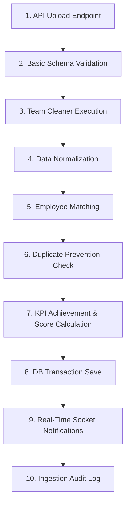

# Excel Ingestion & Upload Pipeline

This document describes the design, execution stages, error detection points, and transactional integrity mechanisms of the Excel workbook upload pipeline.

---

## 1. Pipeline Execution Stages

When an Admin uploads a performance workbook via the dashboard, the data flows through a 10-stage processing pipeline:

### Stage 1: API Ingestion Endpoint
The admin uploads the Excel file to `/api/uploads`. The upload router captures the file payload, initializes a unique tracking ID, and validates file headers.

### Stage 2: Basic Schema Validation
The `ExcelProcessor` checks the spreadsheet's sheets, checking that required sheets and standard column headers exist.

### Stage 3: Team-Specific Cleaner
The `CleanerFactory` resolves the target team name (e.g. Inbound, Coding) and routes the workbook to the corresponding cleaner script (placed inside `Backend/Data_Cleaning_Teams/`).

### Stage 4: Data Normalization
KPI source values are parsed and normalized. Empty fields, text values, time formats (e.g., AHT "MM:SS"), and region codes are standardized.
- **SGHD Employee Code Validation [Planned]:** Normalizing employee codes to ensure call center and offshore teams use standard SGHD-prefixed HR identifiers (e.g., `SGHD70170`).

### Stage 5: Employee Profile Matching
The pipeline checks if the parsed employees exist in the database `employees` table. If a parsed employee profile is missing, a new employee entry is created and associated with the target team.

### Stage 6: Duplicate Prevention Checks
The database check queries the unique composite constraint `(employee_id, month, year)` to ensure records have not already been loaded for that month.
- **Duplicate Prevention Action [Planned]:** The ingestion pipeline will reject the upload or allow overriding existing records.

### Stage 7: KPI Scoring Calculation
The pipeline executes the scoring calculations. Values are calculated according to the KPI's direction (direct vs inverse), and achievements are computed, capped at 100% for contribution score weights, and summed to determine the agent's Final Performance Score.

### Stage 8: Database Transaction Save
The performance record and individual KPI values are saved inside a SQL transaction database block.

### Stage 9: Real-Time Socket Broadcast
A WebSocket notification is published across Socket.IO rooms, notifying active managers and admin views that the ingestion operation was successful.

### Stage 10: Ingestion Audit Log
The execution writes an ingestion summary into the database audit logs table, tracking the total records saved, user ID, and timestamps.

---

## 2. Failure Points & Rollback Strategy

The pipeline is transaction-safe. If a failure occurs at any stage during execution, the database automatically rolls back all operations:

| Failure Type | Stage | Resolution Policy |
| :--- | :--- | :--- |
| **Invalid Workbook Sheet** | Stage 2 | Ingestion stops immediately. No changes are saved to the database. |
| **Parsing Format Exception** | Stage 3 / 4 | Bad cell values (such as text inside a decimal column) raise an exception. The parser catches the error and reports the exact cell coordinate. |
| **Unique Constraint Violation** | Stage 6 | If duplicate data exists for the same employee, month, and year, the SQL unique constraint raises an error. The entire transaction rolls back. |
| **Database Save Failure** | Stage 8 | Database constraints or connection loss trigger a transaction roll back. No database records are written. |

*Rollback Implementation:* The SQLAlchemy transaction is wrapped inside a try-except block. If any error is raised prior to commit, the code executes `session.rollback()`, ensuring the database state remains clean.
