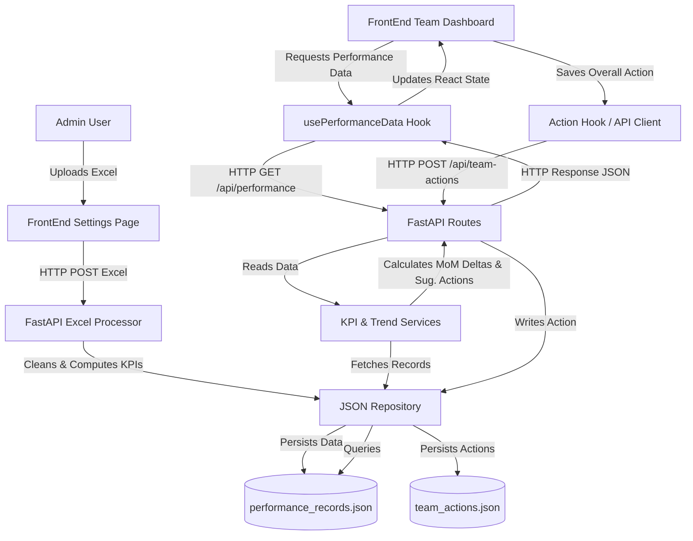

# Performance Management System (PMS) – Project Structure & Architecture Guide

Welcome to the **Performance Management System (PMS)** project documentation. This guide provides a detailed overview of the system architecture, directory structure, data flows, and configuration models to help Team Leaders and Developers understand and navigate the codebase.

---

## 1. High-Level Architecture Overview

The Performance Management System is built using a modern decoupled architecture:
- **FrontEnd**: A single-page application (SPA) built with **React**, **TypeScript**, and **Vite**, styled with **Tailwind CSS**. It provides interactive charts, tabular views of agent performance, administrative control panels, and configuration interfaces.
- **Backend**: A RESTful API service built with **FastAPI** (Python). It handles data storage, business logic processing (KPI formulas, delta calculation, automated root-cause analysis), report exports, and file ingestion.
- **Database**: A lightweight, file-based JSON database. This simplifies deployment, backups, and local development.

### System Data Flow Diagram



---

## 2. Directory Tree & Key Files

The project is structured into two main root directories: `Backend` (FastAPI) and `FrontEnd` (Vite + React).

```text
PMS_Dashboard/
├── Backend/                    # FastAPI (Python) Service
│   ├── api/
│   │   └── routes.py           # REST API Route controllers
│   ├── config/                 # Environment and application settings
│   ├── data/                   # File-based JSON Database
│   │   ├── performance_records.json    # Agent performance scores & raw data
│   │   └── team_actions.json           # Administrative overall team actions
│   ├── exports/                # Output folder for generated reports (.xlsx)
│   ├── models/
│   │   └── schemas.py          # Pydantic models (data schemas & validation)
│   ├── processors/
│   │   └── excel_processor.py  # Cleans, validates, and imports Excel records
│   ├── repositories/
│   │   ├── base.py             # Base repository abstractions
│   │   └── json_repos.py       # JSON database read/write controllers
│   ├── services/
│   │   ├── analysis_service.py # Core math services (MoM, aggregates)
│   │   ├── insights_service.py # Generates auto-insights (top metrics, errors)
│   │   ├── kpi_service.py      # Business logic KPI formulas (SLA, AHT, CR)
│   │   ├── learning_service.py # Recommendations engine
│   │   ├── planning_service.py # Employee corrective action planner
│   │   └── trend_service.py    # Computes trend flags (Stable, Improving, Declining)
│   ├── utils/                  # Helper utilities (dates, formatting)
│   ├── app.py                  # FastAPI server instantiation & middlewares
│   └── main.py                 # Development runner (Uvicorn reload)
│
├── FrontEnd/                   # Vite + React (TypeScript) Application
│   ├── public/                 # Static assets (icons, logos)
│   ├── src/
│   │   ├── components/         # Reusable UI Components
│   │   │   ├── charts/         # Reusable charts (Recharts)
│   │   │   ├── common/         # Layout & Shared UI elements (buttons, inputs)
│   │   │   ├── employee/       # Components specific to individual agent profile
│   │   │   ├── executive/      # Components specific to executive landing page
│   │   │   └── team/           # Components for team performance dashboard
│   │   ├── context/
│   │   │   └── RoleContext.tsx # Globally manages User Session & Role (Admin/Manager/Viewer)
│   │   ├── data/               # Local data fallbacks
│   │   ├── hooks/              # Custom hooks & API communication Layer
│   │   │   ├── useActionStore.ts        # Manages agent-level corrective actions
│   │   │   ├── useMonthParam.ts         # Syncs month selector to URL search query
│   │   │   └── usePerformanceData.ts    # Loads performance data & manages team metrics
│   │   ├── pages/              # Main Route Pages
│   │   │   ├── LoginView.tsx            # Authentication page
│   │   │   ├── ExecutiveView.tsx        # High-level overview & corporate KPI gauges
│   │   │   ├── TeamDashboardView.tsx    # Detailed team view, roster list, summaries
│   │   │   ├── EmployeeProfileView.tsx  # Granular agent metrics, root causes, historical trends
│   │   │   ├── PlanningView.tsx         # coaching & PIP tracking center
│   │   │   └── SettingsView.tsx         # Data configuration & Excel upload interface
│   │   ├── types.ts            # Global TypeScript interface definitions
│   │   ├── App.tsx             # React Router configuration & Route guard mappings
│   │   ├── index.css           # Global CSS styling & design system parameters
│   │   └── main.tsx            # React root mount point
│   ├── index.html              # Main HTML template
│   ├── package.json            # Node project configuration & dependency list
│   └── vite.config.ts          # Vite configuration settings
└── README.md                   # Quickstart instructions
```

---

## 3. Core Component Breakdown (FrontEnd)

The FrontEnd uses a modular architecture with focused pages and lazy-loading components.

### 3.1 Main Pages (`FrontEnd/src/pages/`)
- **LoginView (`LoginView.tsx`)**: Secure gateway. Grants roles (`Admin`, `Manager`, `Viewer`) based on login credentials.
- **ExecutiveView (`ExecutiveView.tsx`)**: The landing page for executives. Displays corporate-wide KPI gauges (Booking CR, Attendance, AHT, Leakage), and includes a team-by-team overview list indicating performance status.
- **TeamDashboardView (`TeamDashboardView.tsx`)**: Shows metrics for a specific team (Inbound, Inbound UAE, Outbound, Pre-Approvals) for a filtered month. Includes:
  - Top & bottom agent performers.
  - Team-specific KPI cards.
  - **Team Performance Summary & Action Needed Card**: Highlights grade distribution, dynamic targets, worst performing agent, and allows the **Admin** to write/save overall team key actions.
- **EmployeeProfileView (`EmployeeProfileView.tsx`)**: Granular view of a single agent's performance. Focuses on:
  - Individual score vs team average.
  - KPI breakdown showing target status.
  - Suggests action plans based on automated root-cause analysis.
- **PlanningView (`PlanningView.tsx`)**: Operations center for managers. List of all agents currently placed on Action Plans (PIP, Coaching, Monitor), showing main issue metrics and action steps.
- **SettingsView (`SettingsView.tsx`)**: Administration interface. Provides drag-and-drop Excel file uploads to ingest new monthly data, and logs upload history.

### 3.2 Custom Hooks & State (`FrontEnd/src/hooks/`)
- **`usePerformanceData.ts`**: The core data provider. Fetches raw metrics from the backend, caches them in memory, and exposes:
  - `useTeamData`: Filters and aggregates scores, calculates grade counts, and determines standard deviations.
  - `useAllTeamsSummary`: Calculates comparative metrics across all corporate departments.
- **`useActionStore.ts`**: Syncs agent-level corrective actions (e.g. PIP, Coaching assignments) with local storage or backend endpoints, providing reactive state updates across pages.

---

## 4. Backend Engine Breakdown

The Backend is designed around standard design patterns to process, calculate, and persist metrics.

### 4.1 Ingestion & Processing (`Backend/processors/`)
- **`excel_processor.py`**: When an Excel sheet is uploaded, this script reads the file using `pandas`. It:
  - Validates sheet headers against the required schema for each team.
  - Standardizes employee names, IDs, and dates.
  - Parses duration strings (e.g. `00:02:45` AHT) into seconds.
  - Computes secondary fields (Conversion Rates, Attendance, SLA targets, Quality scores).
  - Persists the processed records into the JSON database.

### 4.2 Services & Calculation Layer (`Backend/services/`)
- **`kpi_service.py`**: Houses business rules for KPIs. Handles target configurations (e.g. Outbound Booking Conversion target = 46%, Inbound Abandon target <= 1%) and maps raw numbers to performance scores.
- **`trend_service.py`**: Calculates Month-over-Month (MoM), Quarter-over-Quarter (QoQ), and Year-to-Date (YTD) trends to classify scores as `Improving`, `Declining`, or `Stable`.
- **`analysis_service.py`**: Performs statistical calculations, including weighted averages, top/bottom performers sorting, and team grade curves.

### 4.3 Data Persistence (`Backend/repositories/`)
- **`json_repos.py`**: Reads/writes records to the lightweight JSON files. Operates on a thread-safe model using file locks to prevent conflicts during write operations. Contains two main repositories:
  - `JSONPerformanceRepository`: Manages agent metrics.
  - `JSONTeamActionsRepository`: Manages team overall key actions using composite keys (`team_id` + `month`).

---

## 5. Security & Permission Model

Access control is enforced at both the FrontEnd routing layer and Backend controller endpoints.

| User Role | Credentials (Local Dev) | Permissions |
| :--- | :--- | :--- |
| **Admin** | `admin` / `admin123` | **Full Access**: Can upload Excel files, edit config targets, add/edit team overall key actions, add/modify agent corrective action plans, and export Excel reports. |
| **Manager** | `manager` / `manager123` | **Operational Access**: Can add agent corrective action plans, view all dashboards, view settings details (read-only), and export reports. *Cannot upload new data or edit team overall key actions.* |
| **Viewer** | `viewer` / `viewer123` | **Read-Only Access**: Can view executive, team, and employee dashboards. *Cannot add/edit action plans, upload spreadsheets, edit overall actions, or export reports.* |

---

## 6. How to Run the Project (Quickstart)

### Prerequisites
- Python 3.10+
- Node.js 18+

### Step 1: Start the Backend
1. Navigate to the `Backend` directory:
   ```bash
   cd Backend
   ```
2. Create and activate a Python virtual environment:
   ```bash
   python -m venv .venv
   .venv\Scripts\activate
   ```
3. Install dependencies:
   ```bash
   pip install -r requirements.txt
   ```
4. Run the server using Uvicorn:
   ```bash
   python -m uvicorn app:app --reload --port 8000
   ```
   *The backend will run on `http://127.0.0.1:8000`.*

### Step 2: Start the FrontEnd
1. Navigate to the `FrontEnd` directory:
   ```bash
   cd FrontEnd
   ```
2. Install npm packages:
   ```bash
   npm install
   ```
3. Run the Vite development server:
   ```bash
   npm run dev
   ```
   *The application will open on `http://localhost:5174`.*
